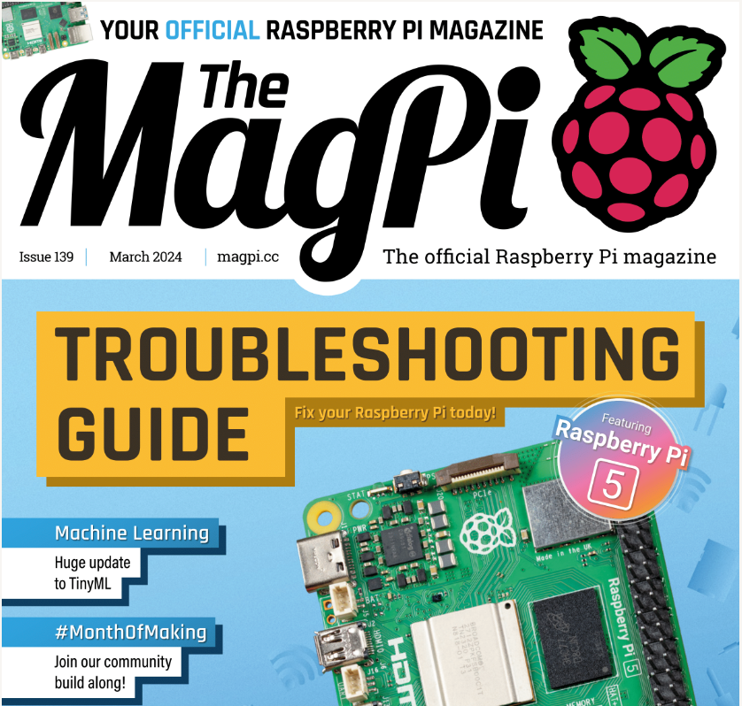
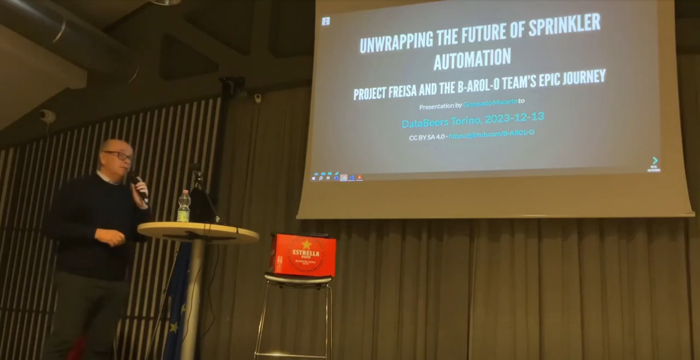

# Four-legged Robot Ensuring Intelligent Sprinkler Automation

<!--  -->

[FREISA](https://www.hackster.io/projects/845012), an acronym for "`F`our-legged `R`obot `E`nsuring `I`ntelligent `S`prinkler `A`utomation", continues the storyline of the [B-AROL-O Team](https://github.com/B-AROL-O?view_as=public)'s saga.

Project FREISA is the **Grand Prize Winner** 🥇 of the [OpenCV AI Competition 2023](https://www.hackster.io/contests/opencv-ai-competition-2023) with [OpenCV](https://www.hackster.io/opencv), [Khadas](https://www.hackster.io/khadas) and [Seeed Studio](https://www.hackster.io/seeed).

In more recent times, FREISA was a **Finalist of [Backdrop Build V3](https://backdropbuild.com/builds/v3/freisa)** and repeated the achievement with [Backdrop Build V4](https://backdropbuild.com/builds/v4/freisa):

## What is FREISA

A detailed writeup of what the FREISA project does has been published on [Hackster.io](https://www.hackster.io/projects/845012) and [Electromaker.io](https://www.electromaker.io/project/view/four-legged-robot-ensuring-intelligent-sprinkler-automation).

[Issue 139](https://magpi.raspberrypi.com/issues/139) of [The MagPi Magazine](https://magpi.raspberrypi.com/) contains a 4-page interview by David Crookes to the B-AROL-O Team who talk about FREISA ([get the PDF here](https://magpi.raspberrypi.com/issues/139/pdf)).

Here is [a short presentation](https://video.linux.it/w/xq3Z9khHJGTzv2NsNc1gK7?start=9m37&stop=20m23) of the FREISA project ([slides](https://speakerdeck.com/pythontorino/unwrapping-the-future-of-sprinkler-automation)) given during [an event which took place in December 2023](https://www.eventbrite.com/e/databeers-torino-episodio-17-tickets-754459006197) organized by [DataBeers Torino](https://twitter.com/databeerstorino) and [Python Torino](https://torino.python.it/)

## The Team

FirstName LastName | GitHub_ID                              | Telegram_ID
-------------------|----------------------------------------|---------------------
[Davide Macario](https://www.linkedin.com/in/davide-macario-b872b4225/) | [@davmacario](https://github.com/davmacario) | DavideMacario
[Eric Orso](https://www.linkedin.com/in/eric-orso-56934124a/) | [@OrsoEric](https://github.com/OrsoEric) | x05032MendicantBias
[Pietro d'Agostino](https://www.linkedin.com/in/pietro-d-agostino-9b8199212/) | [@pitdagosti](https://github.com/pitdagosti) | Pit836
[Gianpaolo Macario](https://www.linkedin.com/in/gmacario/) | [@gmacario](https://github.com/gmacario) | gmacario
[Francesca Petrocchi](https://www.linkedin.com/in/francescapetrocchi/) | [@francipetrocchi](https://github.com/francipetrocchi) | @stabilofuxia
[Gianfranco Poncini](https://www.linkedin.com/in/gianfranco-poncini-b0830340/) | [@Muwattalli](https://github.com/@Muwattalli) | @Togodumno

### FREISA Team Alumni

We express gratitude to the following people who actively contributed to the project but are no longer active in FREISA:

FirstName LastName | Role    | GitHub_ID                                    | Telegram_ID
-------------------|---------|----------------------------------------|---------------------
[Andrea Podo](https://www.linkedin.com/in/andrea-podo-a65209187) | Member  | [@AndreaPodo](https://github.com/AndreaPodo) | andreapodo
[Gianluca Teti](https://www.linkedin.com/in/gianluca-teti) | Advisor | [@gteti](https://github.com/gteti) | Gianteti
[Alessandro Varesi](https://www.linkedin.com/in/alessandrovaresi) | Support and ideas | [@alv67](https://github.com/alv67) | -

## How to stay in touch

You may follow [@baroloteam on Instagram](https://instagram.com/baroloteam) or [@baroloteam on ~~Twitter~~ X](https://x.com/baroloteam) to get notified about the progress of the FREISA project.

Please report bugs and feature requests on <https://github.com/B-AROL-O/FREISA/issues>, or DM [B-AROL-O Team on ~~Twitter~~ X](https://x.com/baroloteam) about security issues or other non-public topics.

## Copyright and license

Copyright (C) 2023-2024, [B-AROL-O Team](https://github.com/B-AROL-O), all rights reserved.

### Source code license

The source code contained in this repository and the executable distributions are licensed under the terms of the MIT license as detailed in the [LICENSE](LICENSE) file.

### Documentation license

Please note that your contribution to the project Documentation is licensed under a Creative Commons Attribution-Share Alike 4.0 License. see <https://creativecommons.org/licenses/by-sa/4.0/>

<!-- EOF -->
