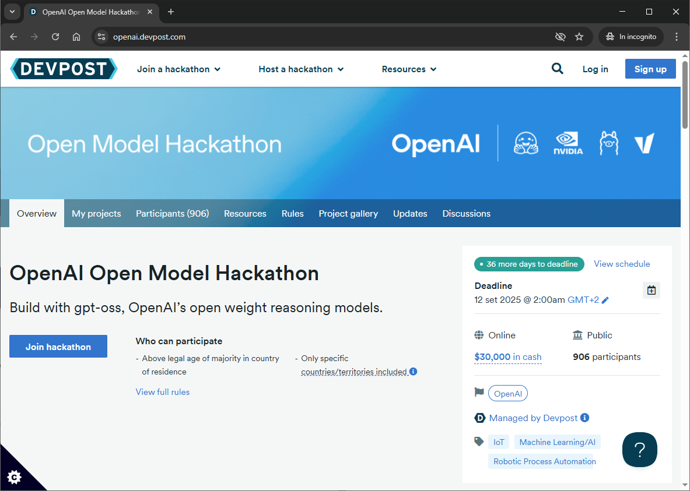
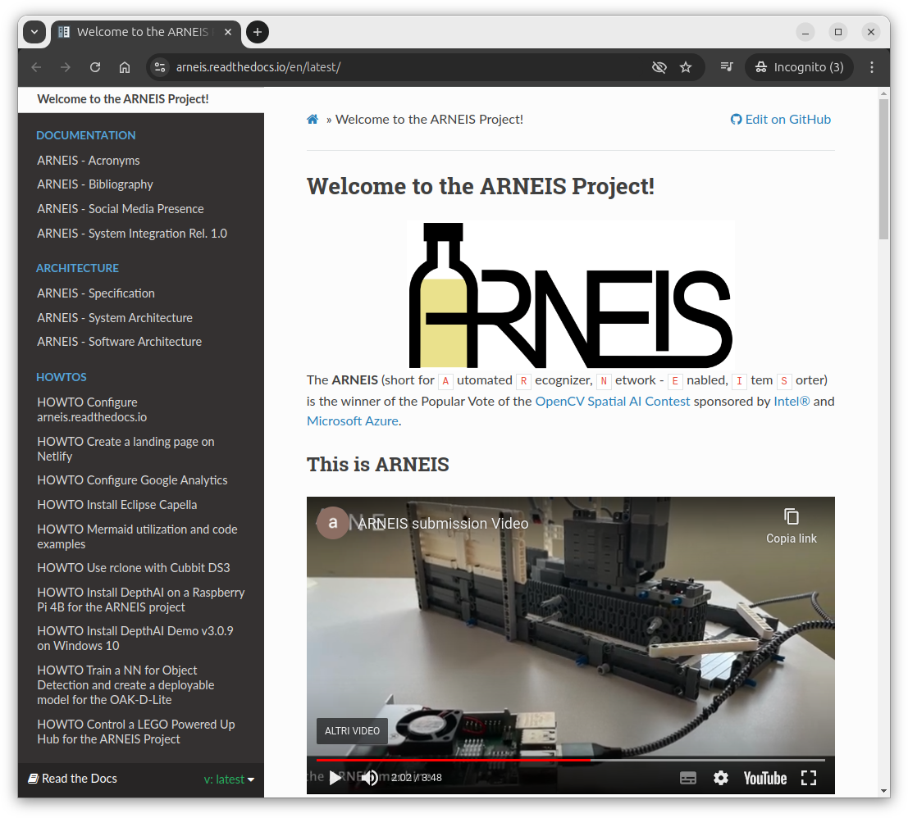

# Four-legged Robot Ensuring Intelligent Sprinkler Automation

**[Project FREISA](https://github.com/B-AROL-O/FREISA)**, an acronym for "`F`our-legged `R`obot `E`nsuring `I`ntelligent `S`prinkler `A`utomation", continues the storyline of the [B-AROL-O Team](https://github.com/B-AROL-O?view_as=public)'s saga.

## 🚀 Latest News – FREISA-GPT

In the last few months FREISA evolved into **FREISA-GPT**, developed in response to the [**OpenAI Open Model Hackathon**](https://openai.devpost.com/).

FREISA-GPT transforms the original FREISA robotic dog into an **intelligent assistant** powered by [**gpt-oss-20b**](https://openai.com/index/introducing-gpt-oss/) open-weight Large Language Model released by [OpenAI](https://openai.com/), thus implementing the following new features:

- Listens to **voice commands** using [Whisper](https://openai.com/index/whisper/) and transforms them into LLM prompts
- Generates structured responses in **JSON**
- Executes **physical actions** (for instance, to move or rotate the robot) thanks to [ros-mcp-server](https://github.com/robotmcp/ros-mcp-server) and [ROS2 Humble](https://docs.ros.org/en/humble/)
- Displays **expressions and sounds** through an ad-hoc **Puppy State Manager**

### How to run FREISA-GPT

To run FREISA-GPT with an emulated version of the pupper, check out the [guide](/docs/howto/howto-run-freisa-gpt.md).

With FREISA-GPT, the project moved from **smart irrigation** to **smart interaction**, making the robotic puppy not only a gardener’s helper but also a conversational, reactive companion.

---

## 🌱 Origins & Achievements – Project FREISA

Project FREISA was the **Grand Prize Winner** 🥇 of the [OpenCV AI Competition 2023](https://www.hackster.io/contests/opencv-ai-competition-2023) with [OpenCV](https://www.hackster.io/opencv), [Khadas](https://www.hackster.io/khadas) and [Seeed Studio](https://www.hackster.io/seeed).

In more recent times, FREISA was a **Finalist of [Backdrop Build v3](https://backdropbuild.com/builds/v3/freisa)** and repeated the same achievement with **[Build v4](https://backdropbuild.com/builds/freisa-wyfd)**, **[Build v5](https://backdropbuild.com/builds/freisa-beuv)** and **[Build v6](https://backdropbuild.com/builds/freisa-beuv)**:

")

We published multiple detailed writeups of FREISA:

- [Hackster.io](https://www.hackster.io/projects/845012) (Nov 2023)
- [Electromaker.io](https://www.electromaker.io/project/view/four-legged-robot-ensuring-intelligent-sprinkler-automation)
- Updated version on [Hackster.io](https://www.hackster.io/projects/89596b)

FREISA was also featured in **Issue 139 of The MagPi Magazine** with a 4-page interview:

And presented live at [DataBeers Torino](https://torino.python.it/) in December 2023 ([video](https://video.linux.it/w/xq3Z9khHJGTzv2NsNc1gK7?start=9m37&stop=20m23), [slides](https://speakerdeck.com/pythontorino/unwrapping-the-future-of-sprinkler-automation)):

---

## 📅 Timeline

- **2023** 🏆 – FREISA wins the **Grand Prize** at the OpenCV AI Competition
- **2023** 🎤 – FREISA is presented at **DataBeers Torino** and featured in **The MagPi Magazine #139**
- **2023–2024** 🔄 – FREISA is selected multiple times as a **Backdrop Build Finalist**
- **2024** 🌱 – Collaboration with **Seeed Studio** and integration with **SenseCAP Watcher**
- **2025** 🚀 – Launch of **FREISA-GPT** at the **OpenAI Open Model Hackathon**, continuing to evolve as a **voice-enabled robotic assistant**

---

## The Team behind FREISA

| FirstName LastName                                                             | GitHub_ID                                     | Telegram_ID         |
| ------------------------------------------------------------------------------ | --------------------------------------------- | ------------------- |
| [Alessio Chessa](https://www.linkedin.com/in/alessiochessa)                    | [@aleche28](https://github.com/aleche28)      | ale_che28           |
| [Pietro d'Agostino](https://www.linkedin.com/in/pietro-d-agostino-9b8199212/)  | [@pitdagosti](https://github.com/pitdagosti)  | Pit836              |
| [Davide Macario](https://www.linkedin.com/in/davide-macario-b872b4225/)        | [@davmacario](https://github.com/davmacario)  | DavideMacario       |
| [Gianpaolo Macario](https://www.linkedin.com/in/gmacario/)                     | [@gmacario](https://github.com/gmacario)      | gmacario            |
| [Eric Orso](https://www.linkedin.com/in/eric-orso-56934124a/)                  | [@OrsoEric](https://github.com/OrsoEric)      | x05032MendicantBias |
| [Gianfranco Poncini](https://www.linkedin.com/in/gianfranco-poncini-b0830340/) | [@Muwattalli](https://github.com/@Muwattalli) | Togodumno           |
| [Gianluca Teti](https://www.linkedin.com/in/gianluca-teti)                     | [@gteti](https://github.com/gteti)            | Giatet              |

### FREISA Team Alumni

We express gratitude to the following people who actively contributed to the project but are no longer active in FREISA:

| FirstName LastName                                                     | Role              | GitHub_ID                                              | Telegram_ID  |
| ---------------------------------------------------------------------- | ----------------- | ------------------------------------------------------ | ------------ |
| [Francesca Petrocchi](https://www.linkedin.com/in/francescapetrocchi/) | Support and ideas | [@francipetrocchi](https://github.com/francipetrocchi) | stabilofuxia |
| [Andrea Podo](https://www.linkedin.com/in/andrea-podo-a65209187)       | Member            | [@AndreaPodo](https://github.com/AndreaPodo)           | andreapodo   |
| [Alessandro Varesi](https://www.linkedin.com/in/alessandrovaresi)      | Support and ideas | [@alv67](https://github.com/alv67)                     | -            |

## Related Projects

### Amarone

Project [Amarone](https://www.hackster.io/projects/185a16) reused some of the code and algorithms originally developed for FREISA.
The project was created by [Gianluca Teti](https://www.linkedin.com/in/gianluca-teti) together with a couple of members of the B-AROL-O team and is available on [Hackster](https://www.hackster.io/projects/185a16).

### ARNEIS

This was the first public project of the B-AROL-O Team. Some of the algorithms and code developed for ARNEIS have been reused and further refined by FREISA.

<https://github.com/B-AROL-O/ARNEIS>

### ChatGPT Robot Kit

Project FREISA is featured in the front page of Kickstarter "Project We Love" campaign "[ChatGPT Robot Kit: Unlock your AI Dream Job](https://www.kickstarter.com/projects/mdrobotkits/md-robot-kits-open-source-support-your-genai-creativity?ref=freisa_homepage)" by [Mangdang Ltd.](https://www.kickstarter.com/profile/mdrobotkits)

### OpenSCAD-lego-library

OpenSCAD library to draw LEGO&reg; beams and plates with custom patterns.
This GitHub repository contains most of the custom 3D-printed parts which are needed to build the FREISA Robot Dog.

<https://github.com/B-AROL-O/OpenSCAD-lego-library>

### SenseCAP Watcher

The B-AROL-O Team was selected by [Seeed Studio](https://www.seeedstudio.com/) to receive one of the 50 SenseCAP Watcher Alpha and delivered a comprehensive [writeup on Hackster.io](https://www.hackster.io/projects/89596b) before its official launch.

Project FREISA has also been featured in the Kickstarter "Project We Love" campaign "[SenseCAP Watcher - The Physical AI Agent for Smarter Spaces](https://www.kickstarter.com/projects/seeed/sensecap-watcher-open-source-ai-assistant-for-smarter-spaces?ref=freisa_homepage)" by [Seeed Studio](https://www.seeedstudio.com/), including the teaser video and a few photos on the front page.

## How to stay in touch

You may follow [@baroloteam on Instagram](https://instagram.com/baroloteam) or [@baroloteam on X](https://x.com/baroloteam) to get notified about the progress of the FREISA project.

Please report bugs and feature requests on <https://github.com/B-AROL-O/FREISA/issues>, or DM [B-AROL-O Team on X](https://x.com/baroloteam) about security issues or other non-public topics.

## Copyright and license

Copyright (C) 2023-2025, [B-AROL-O Team](https://github.com/B-AROL-O), all rights reserved.

### Source code license

The source code contained in this repository and the executable distributions are licensed under the terms of the MIT license as detailed in the [LICENSE](LICENSE) file.

### Documentation license

Please note that your contribution to the project Documentation is licensed under a Creative Commons Attribution-Share Alike 4.0 License. see <https://creativecommons.org/licenses/by-sa/4.0/>

<!-- EOF -->
