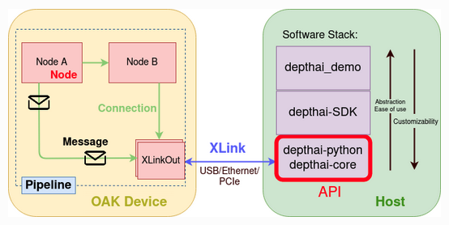

# OAK-D Lite module

This folder contains the code necessary to launch the Docker container used to control the [OAK-D Lite](https://shop.luxonis.com/products/oak-d-lite-1) camera to perform inference and communicate the results over HTTP to the MiniPupper motion control.

This module can be deployed inside a Docker container, provided it has access to the USB bus of the host machine.

## Operation

The `VisionWebServer` class uses [CherryPy](https://cherrypy.dev/) to create an HTTP server, through which clients can control the OAK-D lite camera and get the inference results.
The web server makes use of a `VisionController` object to upload the [YOLOv8](https://yolov8.com/) models on the cameras and run the inference pipelines with these models.

The MiniPupper uses two CV models: one for detecting the trunk of the plant, and the other for detecting the leaves (healthy and unhealthy).

The result will be transmitted to the Mini-Pupper controller program (acting as a web client) so that it will drive the robot towards the objectives (e.g., if seeing a plant, get closer to it).

When launched, no model is active by default, so the client needs to first launch the desired pipeline before being able to retrieve the results.

## Setup

Requirements:

- Have docker installed on the host device (Raspberry Pi)
- Place the models in subfolders of the ["models" folder](./models/), e.g., ./folders/leaves/leaves_detection.json
  - If needed, fix the paths in the [main script](./vision_webserver.py)
- Connect the OAK-D lite camera to the host device using a USB 3 cable

## Running the web server

### Creating the image

To create the image, open a terminal in this folder, and run:

```bash
./create_image.sh
```

This script invokes the [Dockerfile](./Dockerfile) also available in this folder to build an image, named `depthai-freisa:latest`, containing all the required Python packages needed by the server.

The Dockerfile is an adapted version of the [DepthAI Dockerfile](https://github.com/luxonis/depthai/blob/main/Dockerfile).

### Deploying the container

After making sure Docker is up and running on the host, it is possible to launch the web server by running:

```bash
./vision_container.sh
```

This will create a container with the image that was just built and running the [vision web server](./vision_webserver.py).

Since the container is launched in detached mode (`-d` flag in the `docker run` call), to verify the container has successfully started, run `docker ps | grep oak-d-lite-server`.
If the output is not empty, the container has been started successfully.

#### Hint: check the container is running

To verify the container is running, we propose two methods.

The first approach it to perform requests through a HTTP request tool, such as the [Thunder Client](https://marketplace.visualstudio.com/items?itemName=rangav.vscode-thunder-client) extension for Visual Studio Code.

Another possibility is to run the [test program](./test/test_webserver.py) as follows:

```bash
python3 ./test/test_webserver.py -u <http://server_address:9090/>
```

This script will attempt to run each of the available models for 30 seconds, and returns the inference results every 1s.

## Sources and useful material

- [DepthAI docs](https://docs.luxonis.com/projects/api/en/latest/)
- [Deploy YOLO model to OAK camera](https://docs.roboflow.com/deploy/luxonis-oak)
  - YOLOv8 [tutorial](https://github.com/luxonis/depthai-ml-training/blob/master/colab-notebooks/YoloV8_training.ipynb)
- [DepthAI repository](https://github.com/luxonis/depthai)
- [DepthAI Dockerfile](https://github.com/luxonis/depthai/blob/main/Dockerfile)

---

---

## TODO

- [x] Find guides on how to handle results of inference with DepthAI
- [x] Read API specifications of DepthAI
  - [x] Understand how to change the model on the Oak-d lite 'on the fly'
  - [ ] Read documentation about the stereo camera and its ability to evaluate accurate distances (specifically: find a way to get the distance of a detected object from the camera)
- [ ] Translate some Roboflow models to OpenVino or any format compatible with the camera.
- [x] Read and understand the application architecture
- [x] Decide the APIs of this microservice
- [ ] Decide:
  - [x] How should the camera send data to the motion control (Mini Pupper REST API - webserver - is it usable?)
  - [x] How should the camera trigger the model change? Should it wait for some action from the motion control - depending on what it saw before, switch, maybe?

## DepthAI overview

The DepthAI API allows users to communicate and use OAK devices (OAK-D lite in our case).
We will use the Python API.

The following figure shows the architecture of DepthAI:

<!-- markdownlint-disable MD033 -->

<!-- markdownlint-enable MD033 -->

The relevant points of the architecture are:

- XLink: middleware used to exchange data between device (camera) and host
  - XLinkIn: data goes from host to device
  - XLinkOut: data goes from device to host

### APIs

#### Device

`depthai.Device` object: OAK device.
Need to upload a _pipeline_ (`depthai.Pipeline` - see [later](#pipeline)) to it and it will be executed on the onboard processor.
Notice that when initializing the `Device` object, it is needed to provide the pipeline as an argument of the constructor.

```python
pipeline = depthai.Pipeline()

with depthai.Device(pipeline) as device:
    print(f"Connected cameras: {device.getConnectedCameras()}")

    # Init. input queue that will contain messages from host to device
    # Receive msg. with XLinkIn
    input_q = device.getInputQueue("input_name", maxSize=4, blocking=False)

    # Output queue, it will contain messages from device to host
    # Send msg. with XLinkOut
    output_q = device.getOutputQueue("output_name", maxSize=4, blocking=False)

    while True:
        # Get message from output queue
        output_q.get()

        # Send message to device
        cfg = depthai.ImageManipConfig()
        input_q.send(cfg)
```

It is also possible to pass as an argument the device information of the specific device we want to connect to (not needed in our case).

The queues are used to store messages from camera/host to host/camera.
It is necessary to set the queue length and whether it will be blocking or not at initialization, but it is possible to modify these parameters afterward (`queue.setMaxSize(10)` and `queue.setBlocking(True)`).
(_Note_: `blocking=False` means that the arrival of a message at full queue will make it drop the oldest packet to fit the new one in the buffer; with `blocking=True`, instead, incoming packets that cannot fit in the queue will be dropped).

Notice that queues will take up space in the host RAM.

Overview of class `depthai.Device`: [here](https://docs.luxonis.com/projects/api/en/latest/components/device/#reference).

#### Pipeline

`depthai.Pipeline`: a collection of nodes (see [here](#nodes)) and links between them.
It specifies what the device does when powered up.

When passed to a `Device` object, it gets converted to JSON and sent to the camera with XLink.

Steps:

- Initialization: `pipeline = depthai.Pipeline()`
  - Possibility to specify OpenVINO version: `pipeline.setOpenVINOVersion(depthai.OpenVINO.Version.VERSION_2021_4)`
- Create and configure nodes
- Upload pipeline to the device at its instantiation: `device = depthai.Device(pipeline)`

_Note_: by passing to `depthai.Device` a different pipeline, it is possible to 'change' the CV model used in the camera.

Overview of `depthai.Pipeline`: [here](https://docs.luxonis.com/projects/api/en/latest/components/pipeline/#reference).

#### Nodes

`depthai.node`: building block(s) of the pipeline.
Each node provides a specific functionality and a set of configurable inputs & outputs.

Nodes can be connected to communicate (unidirectional flows).
Need to ensure that the inputs can keep up with the outputs they receive data from (queues).
Also here it is necessary to decide whether to make inputs blocking or not.

Notable nodes:

- `depthai.node.ColorCamera`: provide as output the image frames captured by the color camera on the OAK device.
  - Creation: `cam = pipeline.create(depthai.node.ColorCamera)`.
  - Can extract different output formats (e.g., cropped). The following are all `ImageFrame` objects:
    - `raw` output: RAW10
    - `isp` output: YUV420
    - `still` output: NV12 (similar to taking photo)
    - `preview` output: RGB, used to feed image into `NeuralNetwork` (or other models analyzing RGB images)
    - `video` output: NV12 (bigger size frames)
  - [Full documentation](https://docs.luxonis.com/projects/api/en/latest/components/nodes/color_camera/#colorcamera)
- `depthai.node.VideoEncoder`: encode an `ImgFrame` onto specific formats.
- `depthai.node.ImageManip`: used to perform manipulations on images provided as inputs (`ImageFrame` objects).
  - Specific methods determine specific transformations
  - [Full documentation](https://docs.luxonis.com/projects/api/en/latest/components/nodes/image_manip/#imagemanip)
- `depthai.node.StereoDepth`: use the onboard stereo camera to get the disparity/depth.
  - Need configuration ([guide](https://docs.luxonis.com/projects/api/en/latest/tutorials/configuring-stereo-depth/#configuring-stereo-depth))
  - Among the outputs, it is possible to find `depth` which is an `ImgFrame` indicating the distance of each point in millimeters.
  - The inputs are the left and right stereo camera flows, plus the configuration for the `StereoDepth` node.
  - Full [guide](https://docs.luxonis.com/projects/api/en/latest/components/nodes/stereo_depth/#stereodepth).
- `depthai.node.SpatialLocationCalculator`: used to provide the spatial coordinates of the specified region of interest.
  - Inputs: `inputConfig`, `inputDepth` (from `Stereodepth`)
  - Specifying ROI:
    - Initialize node: `spatialCalc = pipeline.create(depthai.node.SpatialLocationCalculator)`
    - Extract config: `config = depthai.SpatialLocationCalculatorConfigData()`
    - Modify settings: `config.depthThresholds.lowerThreshold = 100` (minimum value of depth to actually provide spatial location info)
    - Set ROI: `config.roi = depthai.Rect(topLeft, bottomRight)`
    - Update config of node: `spatialCalc.initialConfig(addROI())`
    - Full [guide](https://docs.luxonis.com/projects/api/en/latest/components/nodes/spatial_location_calculator/#spatiallocationcalculator).
- `depthai.node.NeuralNetwork`: upload a neural network in OpenVINO format (as long as all layers fit in memory)
  - Generic neural network block (more specialized ones exist - see `depthai.node.MobileNetDetectionNetwork`)
  - Input: any message type
  - [Full documentation](https://docs.luxonis.com/projects/api/en/latest/components/nodes/neural_network/#neuralnetwork)
- `depthai.node.MobileNetDetectionNetwork`: used to apply the MobileNet NN (with specific parameters, to be uploaded) to an image stream.
  - Procedure:
    - Create pipeline: `pipeline = dai.Pipeline()`
    - Add node: `mobilenetDet = pipeline.create(dai.node.MobileNetDetectionNetwork)`
    - Set confidence threshold: `mobilenetDet.setConfidenceThreshold(0.5)`
    - Pass model parameters: `mobilenetDet.setBlobPath(nnBlobPath)`
    - Set number of threads for inference: `mobilenetDet.setNumInferenceThreads(2)`
    - Customize output type (e.g., non-blocking - drop oldest): `mobilenetDet.input.setBlocking(False)`
- `depthai.node.YoloDetectionNetwork`: deploy YOLO neural network (with result decoding) - the output is an [`ImgDetections` object](https://docs.luxonis.com/projects/api/en/latest/components/messages/img_detections/#imgdetections) (as for `MobileNetDetectionNetwork`)
  - Usage:
    - Initialize node in pipeline: `yoloDet = pipeline.create(depthai.node.YoloDetectionNetwork)`
    - Pass model (blob): `yoloDet.setBlobPath`
    - Set specific parameters (see [full guide](https://docs.luxonis.com/projects/api/en/latest/components/nodes/yolo_detection_network/#yolodetectionnetwork) for a list of parameters to be tuned)
- `depthai.node.XLinkIn`: used to send data from host (RPi) to device (OAK-D lite) via XLink.
  - Creation: `xLinkIn = pipeline.create(depthai.node.XLinkIn)`

<!-- EOF -->
