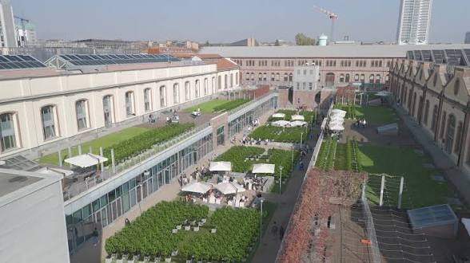
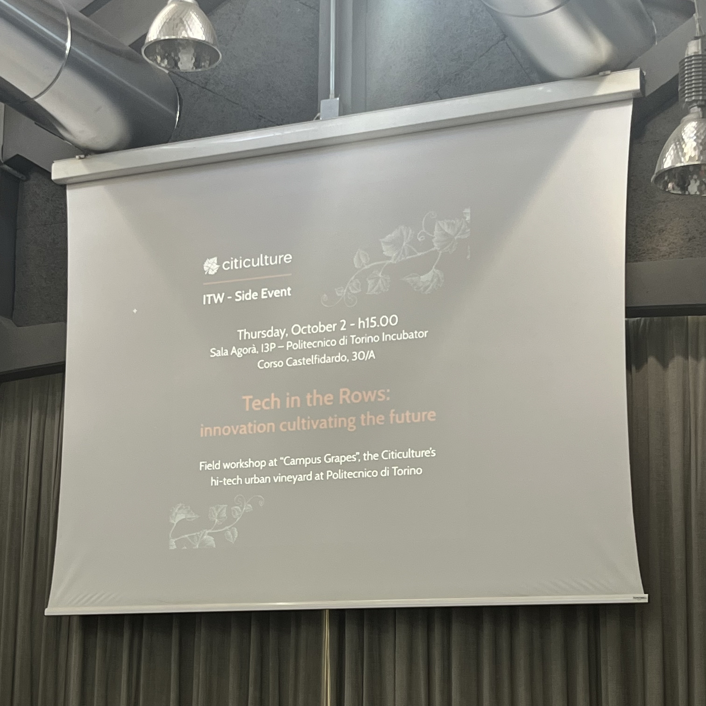
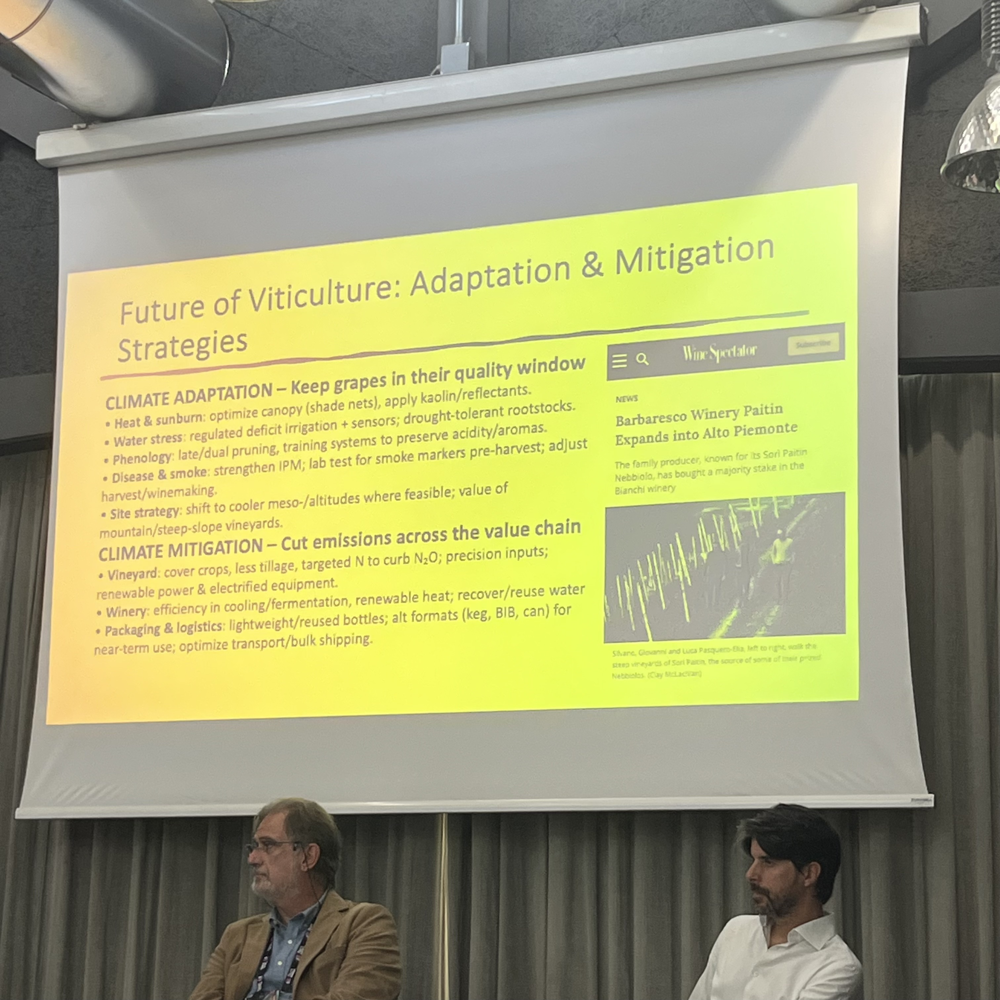
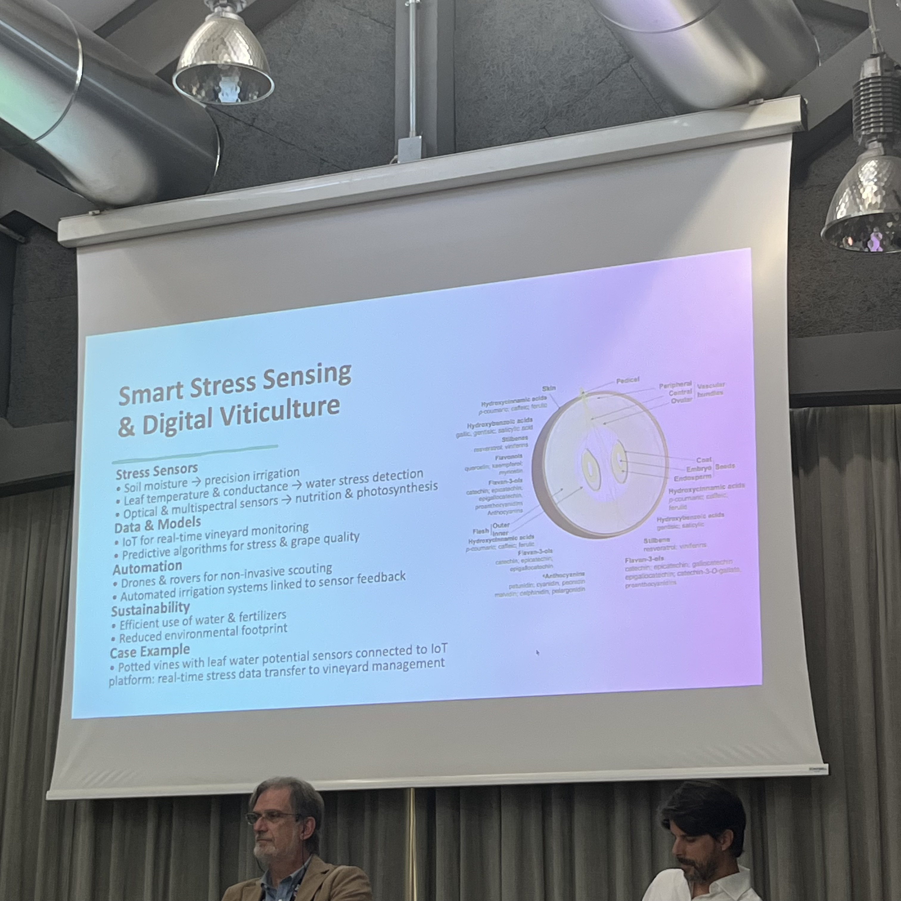
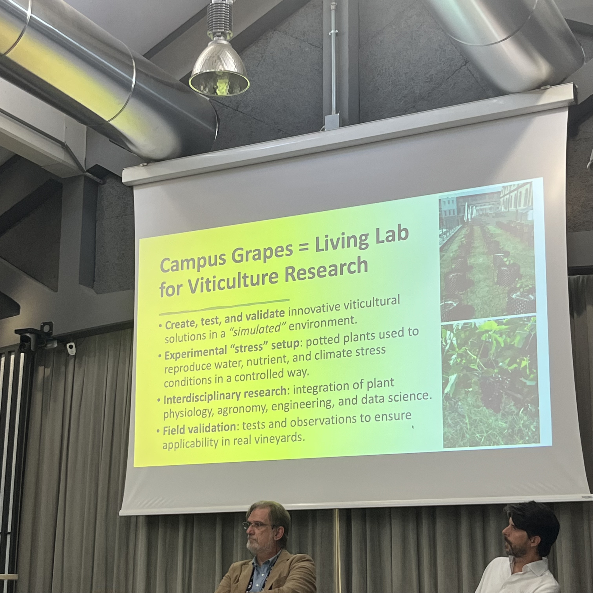
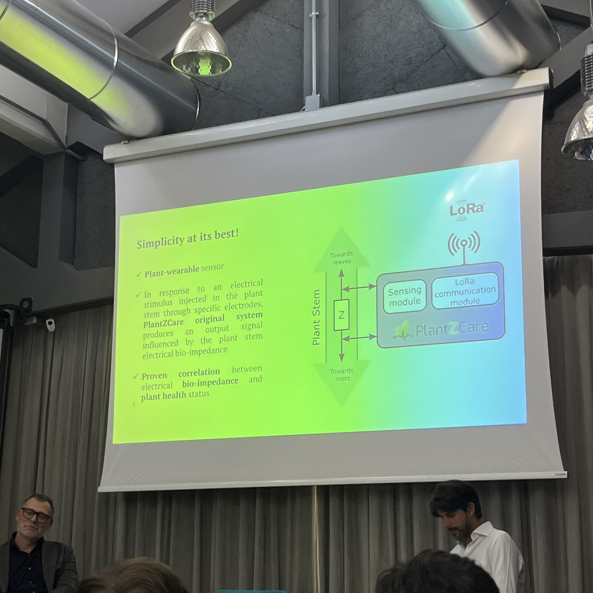
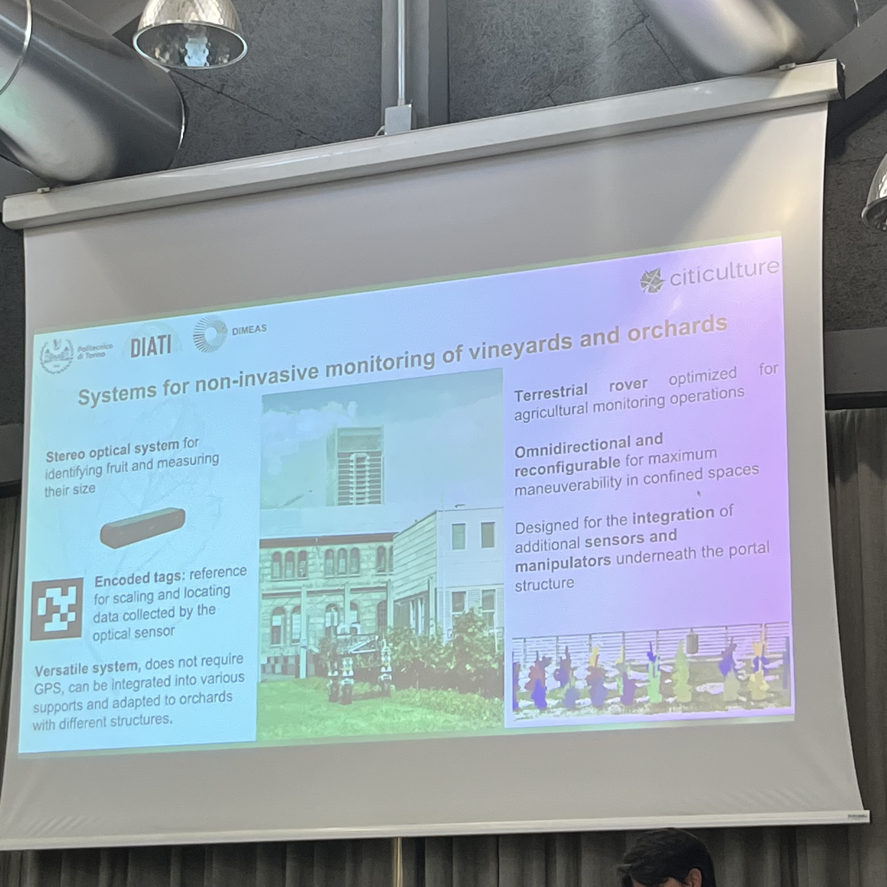
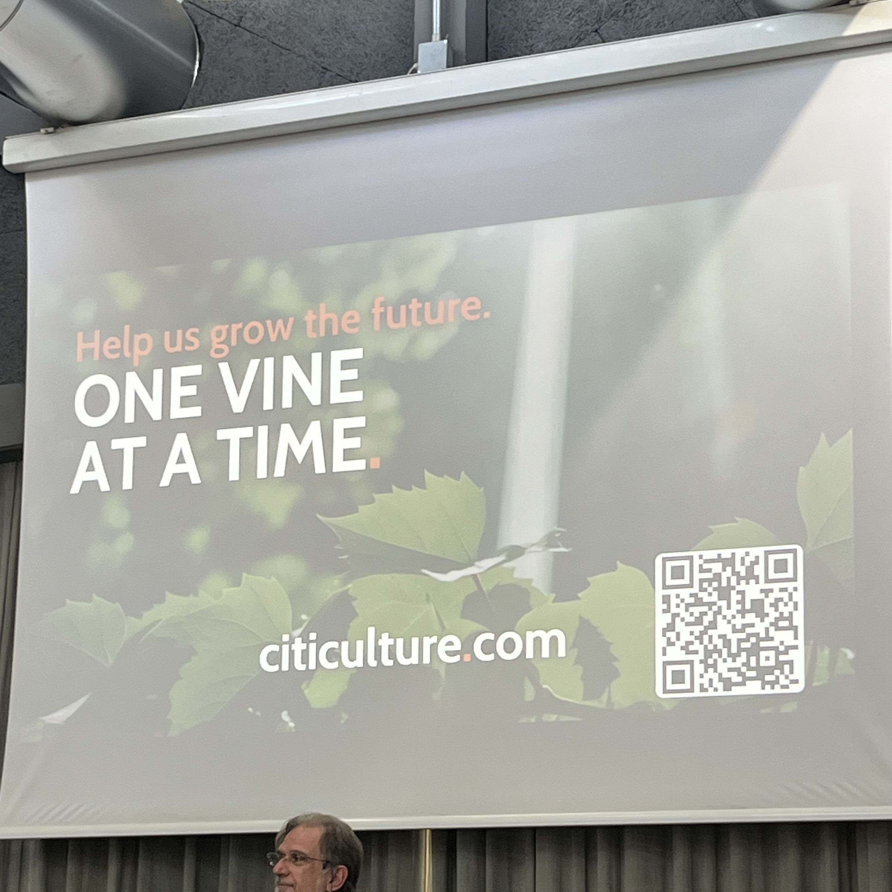

## 2025-10-02 - Tech in the Rows - Innovation Cultivating the Future

Image credits: <https://citiculture.com/en/lp/be-part-of-the-change>

## Speakers

- **[Paolo Sabbatini](https://www.disafa.unito.it/do/docenti.pl/Show?_id=psabbati#tab-profilo)**  
  Professor of Agriculture and Viticulture at the University of Turin (UniTO).
  Specialises in sustainable vineyard management and climate adaptation strategies.
  Mail: [paolo.sabbatini@unito.it](mailto:paolo.sabbatini@unito.it)  
  Phone: +393455834561  

- **[Danilo Demarchi](https://www.google.com/search?client=safari&rls=en&q=danilo+demarchi+polito&ie=UTF-8&oe=UTF-8)**  
  Professor of Bioengineering at the Polytechnic University of Turin (PoliTO).
  Focuses on the integration of biomedical technologies into agricultural practices.
  Mail: [danilo.demarchi@polito.it](mailto:danilo.demarchi@polito.it)

- **[Luca Balbiano](https://www.linkedin.com/in/lucabalbiano/)**  
  Founder of Citiculture, a startup dedicated to urban viticulture and sustainable agriculture.  
  Leads the "Campus Grapes" project at PoliTO.  
  mail: [luca@citiculture.com](mailto:luca@citiculture.com)

- **Bianca Serito**
  Industry representative from Lavazza, contributing expertise in sustainable practices within the food and beverage sector.

## Challenges in Viticulture

Recent years have seen significant challenges in viticulture, including:

- **Prolonged droughts**
- **Wildfires**
- **Fungal diseases**
- **Late frosts and extreme heat events**

Climate change has exacerbated these issues, with average global temperatures increasing by approximately 1.5°C over the past 70 years. This warming trend has led to earlier budbreaks and harvests, affecting grape quality and wine characteristics. Additionally, unpredictable weather patterns, such as spring frosts and heatwaves, have become more frequent, posing further risks to grapevine health and productivity. ([The Guardian][1])

Studies predict that up to 70% of traditional wine regions could become unsuitable for viticulture by the end of the century due to these climatic changes. ([Loosen Bros USA][2])

## Campus Grapes: A Technological Response

The "Campus Grapes" initiative, a collaboration between Citiculture and PoliTO, aims to transform urban spaces into hubs of sustainable viticulture and innovation. Located within the Polytechnic University of Turin, this project serves as an experimental vineyard and an open-air laboratory for research and development in agriculture and technology.

### Key Areas of Focus

1. **Urban Microclimate Analysis**
   Studying the effects of urban environments on vine growth and developing strategies to mitigate adverse conditions.

2. **Genetics and Plant Breeding**
   Researching PIWI VOLTIS grape varieties, which are resistant to fungal diseases, to enhance sustainability and reduce chemical pesticide use.

3. **Training and Pruning Techniques**
   Innovating vineyard management practices to improve vine health and grape quality.

4. **Stress Biology Research**
   Utilising wearable sensors to monitor plant stress in real time, enabling early intervention and improved crop management. ([ACS Publications Chemistry Blog][3])

5. **Predictive Maintenance**
   Applying predictive analytics to anticipate and address potential issues in vineyard operations, enhancing efficiency and sustainability.

The vineyard is open to collaboration with companies and researchers interested in conducting experiments and studies related to viticulture and environmental sustainability.

## PlantZCare: Wearable Technology for Vineyards

Building on biomedical advancements, the "PlantZCare" project introduces wearable sensors for plants, akin to human health monitoring devices. These sensors are designed to detect physiological stress in grapevines, providing real-time data on plant health and enabling timely interventions. This approach aims to enhance vineyard management by integrating technology into traditional agricultural practices. ([ACS Publications Chemistry Blog][3])

## Conclusions

The "Tech in the Rows" event underscores the importance of integrating technology and innovation into viticulture to address the challenges posed by climate change. Initiatives like "Campus Grapes" and "PlantZCare" exemplify how interdisciplinary collaboration can lead to sustainable solutions in agriculture. By embracing technological advancements, the viticulture industry can adapt to changing environmental conditions and ensure the continued production of quality wines.

## Bibliography

- [As blazes spread, French winemakers rue loss of 'fire break' vineyards](https://www.reuters.com/sustainability/climate-energy/blazes-spread-french-winemakers-rue-loss-fire-break-vineyards-2025-08-07/) - Reuters, 2025-08-08
- [From parched earth to landslides: crisis in the prosecco hills of Italy](https://www.theguardian.com/environment/article/2024/jun/08/from-parched-earth-to-landslides-crisis-in-the-prosecco-hills-of-italy) - The Guardian, 2024-06-08
- [How climate change is redrawing Europe’s wine map](https://www.ft.com/content/1c94c23a-90f1-465f-99c0-0c83f9b20b49) - Financial Times

[1]: https://www.theguardian.com/environment/2021/dec/09/climate-crisis-wine-industry "Frosts, heatwaves and wildfires: the climate crisis is hitting ..."
[2]: https://loosenbrosusa.com/how-climate-impacts-your-glass-loosen-bros-usa-monthly-newsletter/ "How Climate Impacts Your Glass"
[3]: https://axial.acs.org/agriculture-and-food-chemistry/wearable-sensor-for-plants-monitors-stress-in-real-time "Wearable Sensor for Plants Monitors Stress in Real Time"

<!-- EOF -->
