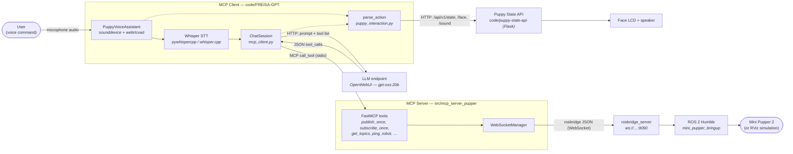
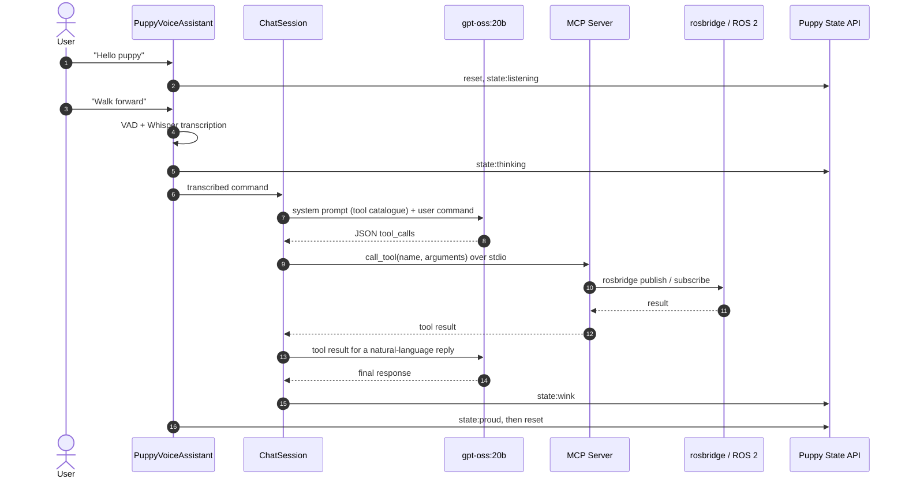
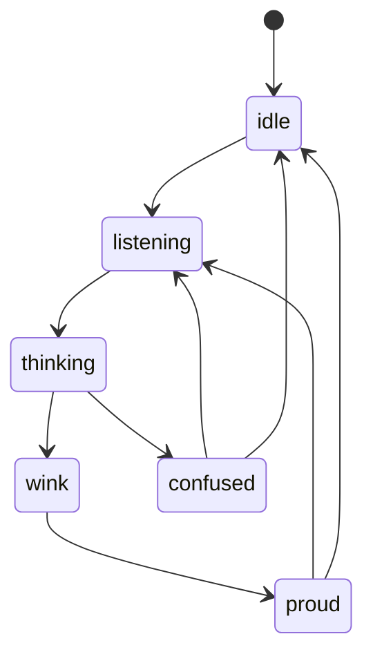

# FREISA-GPT architecture

This document describes the architecture of [FREISA-GPT](/code/FREISA-GPT), the
voice-driven, LLM-powered evolution of Project FREISA presented at the
[OpenAI Open Model Hackathon](https://devpost.com/software/todo-hsifwn).

FREISA-GPT lets a human talk to the Mini Pupper 2 robot dog in plain language.
A local speech-to-text stage turns the voice command into text, an open-weight
LLM ([`gpt-oss:20b`](https://openai.com/index/introducing-gpt-oss/)) decides
which robot capability to invoke, and the resulting tool call is executed on the
robot through ROS 2. In parallel, the puppy shows what it is doing through
facial expressions and sounds.

## Component overview

| Component               | Location                                                                                                                | Role                                                                                                                                                                                                                   |
| ----------------------- | ----------------------------------------------------------------------------------------------------------------------- | ---------------------------------------------------------------------------------------------------------------------------------------------------------------------------------------------------------------------- |
| **MCP Client**          | [`code/FREISA-GPT`](/code/FREISA-GPT)                                                                                   | Entry point. Captures audio, transcribes it, talks to the LLM, dispatches tool calls, and drives the puppy's expressions.                                                                                              |
| **PuppyVoiceAssistant** | [`src/mcp_client_pupper/puppy_voice_assistant.py`](/code/FREISA-GPT/src/mcp_client_pupper/puppy_voice_assistant.py)     | Speech-to-text stage: captures microphone blocks with `sounddevice`, detects speech with `webrtcvad`, and transcribes with `pywhispercpp`. Listens for the wake phrase before accepting a command.                     |
| **ChatSession**         | [`src/mcp_client_pupper/mcp_client.py`](/code/FREISA-GPT/src/mcp_client_pupper/mcp_client.py)                           | Builds the system prompt from the MCP tool catalogue, sends the conversation to the LLM, parses the returned `tool_calls`, and routes each call to the MCP server that owns the tool.                                  |
| **LLMClient**           | [`src/mcp_client_pupper/utils/llm_client.py`](/code/FREISA-GPT/src/mcp_client_pupper/utils/llm_client.py)               | HTTP client for an OpenWebUI-compatible endpoint (`POST /api/chat/completions`).                                                                                                                                       |
| **MCP Server**          | [`src/mcp_server_pupper`](/code/FREISA-GPT/src/mcp_server_pupper)                                                       | [FastMCP](https://github.com/jlowin/fastmcp) server, based on [ros-mcp-server](https://github.com/robotmcp/ros-mcp-server), exposing the robot's ROS 2 interface as MCP tools. Launched as a subprocess by the client. |
| **WebSocketManager**    | [`src/mcp_server_pupper/utils/websocket_manager.py`](/code/FREISA-GPT/src/mcp_server_pupper/utils/websocket_manager.py) | Maintains the WebSocket connection to `rosbridge` and translates tool arguments into rosbridge operations.                                                                                                             |
| **Puppy State API**     | [`code/puppy-state-api`](/code/puppy-state-api)                                                                         | Flask HTTP server implementing the puppy [state machine](/code/puppy-state-api/puppy_state_machine_specs.md); renders faces on the LCD and plays sounds.                                                               |
| **rosbridge / ROS 2**   | external                                                                                                                | `rosbridge_server` exposes ROS 2 topics and services over a WebSocket; `mini_pupper_bringup` drives the physical robot (or the RViz simulation).                                                                       |

## Interaction flow

A single voice command travels through the system as follows.

The puppy's visible state follows the
[state machine](/code/puppy-state-api/puppy_state_machine_specs.md) configured
in [`puppy_config.json`](/code/puppy-state-api/puppy_config.json):

## Interfaces and defaults

| Link                         | Protocol                          | Default                                                                                                                           |
| ---------------------------- | --------------------------------- | --------------------------------------------------------------------------------------------------------------------------------- |
| MCP Client → LLM             | HTTP (OpenAI-compatible)          | `https://openwebui.gmacario.it`, model `gpt-oss:20b` — override with `--llm-base-url` / `--llm-model`                             |
| MCP Client → MCP Server      | MCP over `stdio`                  | configured in [`servers_config.json`](/code/FREISA-GPT/servers_config.json); the server also supports `sse` and `streamable-http` |
| MCP Server → rosbridge       | WebSocket (rosbridge v2 protocol) | `ws://127.0.0.1:9090`                                                                                                             |
| MCP Client → Puppy State API | HTTP REST                         | `http://localhost:5080` — override with `--puppy-api-url`                                                                         |

The wake phrase is `Hello puppy` (fuzzy-matched); the default Whisper model is
`small.en`. Run `uv run main.py --help` in [`code/FREISA-GPT`](/code/FREISA-GPT)
for the full list of options.

## See also

- [HOWTO: Run FREISA-GPT](/docs/howto/howto-run-freisa-gpt.md) — local setup
  with an emulated robot
- [FREISA REST APIs](/docs/apis.md)
- [Puppy state machine specification](/code/puppy-state-api/puppy_state_machine_specs.md)

<!-- EOF -->
