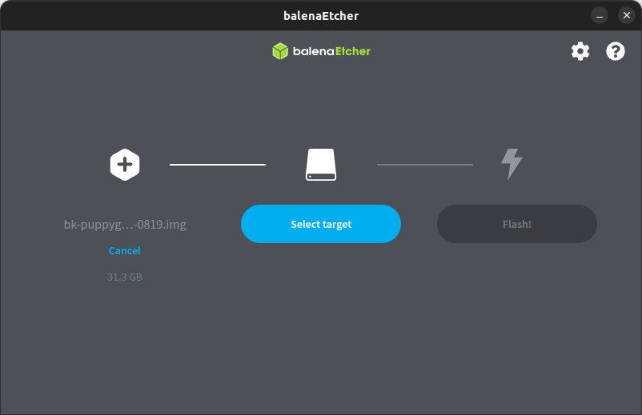
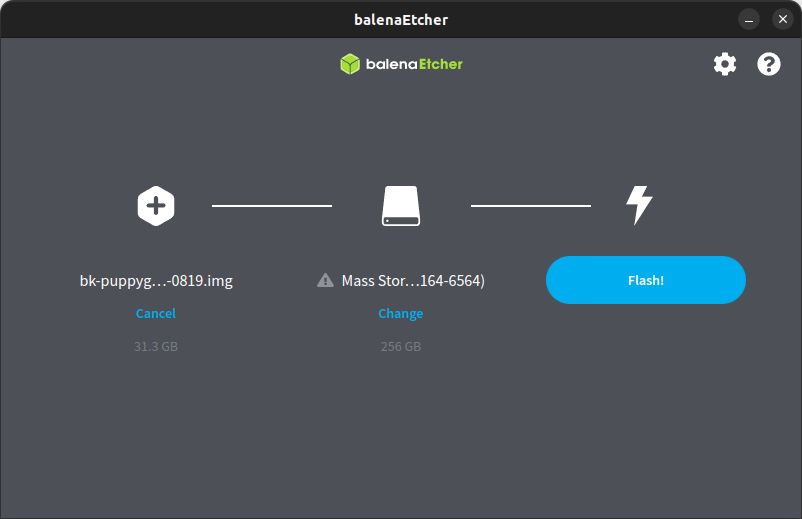

# HOWTO Backup and Restore Raspberry Pi System Images

This document explains

1. How to backup Raspberry Pi system images stored on MicroSDHC <!-- (TODO: or the CM4 on-board eMMC, or USB) -->
2. How to restore a system image backup to a different storage device

## Backup System Image

<!-- (2025-09-02 08:24 CEST) -->

1. Shutdown the puppy and remove the MicroSDHC.
2. Insert the MicroSDHC into one USB SD Card reader
3. Insert the SD Card reader into one USB port of the host PC or Raspberry Pi (assuming it runs Linux)
4. Type the following commands on the host to dump the SD Card contents into a `*.img.gz` file:

```bash
# Identify the device assigned to the SD Card
# (replace '/dev/sdX` with the actual device)
lsblk

# Create the actual backup
mkdir -p ~/Downloads/BK_FREISA_IMAGES
cd ~/Downloads/BK_FREISA_IMAGES
sudo dd if=/dev/sdX of=bk-HOSTNAME-YYYYMMDD-HHMM.img status=progress
sudo chown $USER bk-HOSTNAME-YYYYMMDD-HHMM.img
gzip bk-HOSTNAME-YYYYMMDD-HHMM.img

# Display archive size and SHA256 checksum
ls -la bk-HOSTNAME-YYYYMMDD-HHMM.*
sha256sum bk-HOSTNAME-YYYYMMDD-HHMM.*
```

Result:

```text
gmacario@hw2228:~/Downloads $ cd BK_FREISA_IMAGES/
gmacario@hw2228:~/Downloads/BK_FREISA_IMAGES $ sudo dd if=/dev/sdc of=bk-puppygm03-20250902-0819.img status=progress
gmacario@hw2228:~/Downloads/BK_FREISA_IMAGES $ sudo dd if=/dev/sdc of=bk-puppygm03-20250902-0819.img status=progress
31260656128 bytes (31 GB, 29 GiB) copied, 1970 s, 15,9 MB/s
61067264+0 records in
61067264+0 records out
31266439168 bytes (31 GB, 29 GiB) copied, 1971,72 s, 15,9 MB/s
gmacario@hw2228:~/Downloads/BK_FREISA_IMAGES $ sudo chown $USER bk-puppygm03-20250902-0819.img
gmacario@hw2228:~/Downloads/BK_FREISA_IMAGES $ ls -la bk-puppygm03-20250902-0819.img
-rw-r--r-- 1 gmacario root 31266439168 set  2 08:54 bk-puppygm03-20250902-0819.img
gmacario@hw2228:~/Downloads/BK_FREISA_IMAGES $ gzip bk-puppygm03-20250902-0819.img
gmacario@hw2228:~/Downloads/BK_FREISA_IMAGES $ ls -la bk-puppygm03-20250902-0819.*
-rw-r--r-- 1 gmacario gmacario 3825959893 set  2 08:54 bk-puppygm03-20250902-0819.img.gz
gmacario@hw2228:~/Downloads/BK_FREISA_IMAGES $ sha256sum bk-puppygm03-20250902-0819.*
22c1ee35bd824e687b5146cb8d451b38e15bbab3f61aaadc374e73b359b70897  bk-puppygm03-20250902-0819.img.gz
gmacario@hw2228:~/Downloads/BK_FREISA_IMAGES $
```

Eject the SD Card from the PC.

### Backup Strategy

We strongly suggest to adopt a [**3-2-1 Backup Strategy**](https://en.wikipedia.org/wiki/Glossary_of_backup_terms) and keep multiple copies of the file(s) just backed up, including one on a reliable online service such as:

- [Amazon S3](https://aws.amazon.com/s3)
- [Azure Blob Storage](https://azure.microsoft.com/en-us/products/storage/blobs)
- [Cubbit Cloud](https://www.cubbit.io)
- [Dropbox](https://www.dropbox.com/)
- [Git Large File Storage](https://git-lfs.com/)
- [Microsoft OneDrive](https://www.microsoft.com/en-us/microsoft-365/onedrive)

### Synchronization Tools

Several tools - either proprietary or Open Source - exist to ensure that the files stored in different locations are kept aligned and in sync.

Some of the best examples in the Open Source world are:

- [rclone](https://rclone.org/)
- [rsync](https://en.wikipedia.org/wiki/Rsync)

Those two programs are available for nearly all Operating Systems and - being command-line based - they can also be used from inside scripts and application software.

## Restore System Image

We suggest to use [balenaEtcher](https://etcher.balena.io/) for writing the image to other SD Cards.

Insert a blank SD Card into the USB reader, then type

```bash
balena-etcher
```


Select either the file or the remote URL of the backup.



Select the target MicroSDHC (in our case, a SanDisk Ultra 256 GB)



Click **Flash!** and wait until balenaEtcher completes successfully.

## Customize System Image

TODO: Understand how to configure cloud-init by modifying the following files on the FAT32 partition of the SD Card (the one mounted as `/boot/firmware`):

- `user-data`
- `meta-data`
- `network-config`

Reference: <https://cloudinit.readthedocs.io/en/latest/explanation/format.html>

TODO

<!-- EOF -->
