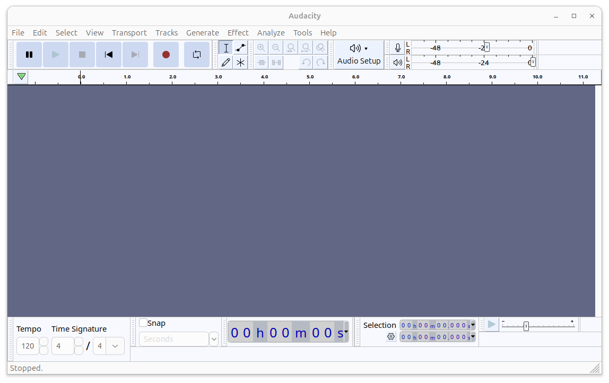

# HOWTO Using ReSpeaker Mic Array

<!-- (2025-08-28 11:20 CEST) -->

## Reference documentation

- ReSpeaker XVF3000 Product Page (SKU 107990193): <https://www.seeedstudio.com/ReSpeaker-USB-Mic-Array-p-4247.html>
- ReSpeaker Introduction (from Seeed Studio wiki): <https://wiki.seeedstudio.com/ReSpeaker>
- ReSpeaker on GitHub: <https://github.com/respeaker>

<!-- - (NEW) ReSpeaker XVF3800 Product Page (SKU 114993701): <https://www.seeedstudio.com/ReSpeaker-XVF3800-USB-4-Mic-Array-With-Case-p-6490.html> -->

## Testing ReSpeaker on `hw2482` (Ubuntu-desktop 24.04.x)

### USB Device identification

Connect the microphone to one USB port of `hw2482` using a USB-A to MicroUSB cable

```bash
sudo dmesg -w
```

Result:

```text
[270050.088145] usb 1-6: new full-speed USB device number 7 using xhci_hcd
[270050.407180] usb 1-6: device descriptor read/64, error -71
[270050.632360] usb 1-6: New USB device found, idVendor=2886, idProduct=0018, bcdDevice= 3.00
[270050.632374] usb 1-6: New USB device strings: Mfr=1, Product=3, SerialNumber=0
[270050.632381] usb 1-6: Product: ReSpeaker 4 Mic Array (UAC1.0)
[270050.632386] usb 1-6: Manufacturer: SEEED
[270050.669994] mc: Linux media interface: v0.10
[270050.710255] usbcore: registered new interface driver snd-usb-audio
```

### Recording and Playback from Linux command-line

Reference: <https://wiki.seeedstudio.com/respeaker_xvf3800_introduction/>

Find sound card number:

```bash
arecord -l
```

Result:

```text
gmacario@hw2482:~$ arecord -l
**** List of CAPTURE Hardware Devices ****
card 0: PCH [HDA Intel PCH], device 0: ALC3861 Analog [ALC3861 Analog]
  Subdevices: 1/1
  Subdevice #0: subdevice #0
card 0: PCH [HDA Intel PCH], device 2: ALC3861 Alt Analog [ALC3861 Alt Analog]
  Subdevices: 2/2
  Subdevice #0: subdevice #0
  Subdevice #1: subdevice #1
card 3: ArrayUAC10 [ReSpeaker 4 Mic Array (UAC1.0)], device 0: USB Audio [USB Audio]
  Subdevices: 1/1
  Subdevice #0: subdevice #0
gmacario@hw2482:~$
```

In the case of `hw2482`, **card number is 3**

Record audio (5 seconds)

```bash
arecord -D plughw:3,0 -c 2 -r 16000 -f S16_LE -d 5 output.wav
```

Replace `3` with your actual sound card number

Result:

```text
gmacario@hw2482:~$ arecord -D plughw:3,0 -c 2 -r 16000 -f S16_LE -d 5 output.wav
Recording WAVE 'output.wav' : Signed 16 bit Little Endian, Rate 16000 Hz, Stereo
gmacario@hw2482:~$
```

Try Playback:

```bash
aplay -D plughw:3,0 output.wav
```

No audio is output.

It looks like `hw2482` has no audio output devices at the moment.

### Recording on `hw2482` using Audacity

Make sure that [Audacity](https://www.audacityteam.org/) is installed:

```bash
sudo apt -y install audacity
```

Run the program (will open a GUI)

```bash
audacity
```



## Testing ReSpeaker on `delta` (Ubuntu-desktop 24.04.x)

<!-- (2025-08-28 18:26 CEST) -->

Connect the microphone to one USB port of `delta` using a USB-A to MicroUSB cable

```bash
sudo dmesg -w
```

Result:

```text
[ 1693.706938] usb 1-3: new full-speed USB device number 4 using xhci_hcd
[ 1693.834657] usb 1-3: New USB device found, idVendor=2886, idProduct=0018, bcdDevice= 3.00
[ 1693.834676] usb 1-3: New USB device strings: Mfr=1, Product=3, SerialNumber=0
[ 1693.834683] usb 1-3: Product: ReSpeaker 4 Mic Array (UAC1.0)
[ 1693.834689] usb 1-3: Manufacturer: SEEED
[ 1693.920743] usbcore: registered new interface driver snd-usb-audio
```

Find sound card number:

```bash
arecord -l
```

Result:

```text
gmacario@delta:~$ arecord -l
**** List of CAPTURE Hardware Devices ****
card 0: PCH [HDA Intel PCH], device 0: ALC3246 Analog [ALC3246 Analog]
  Subdevices: 1/1
  Subdevice #0: subdevice #0
card 1: ArrayUAC10 [ReSpeaker 4 Mic Array (UAC1.0)], device 0: USB Audio [USB Audio]
  Subdevices: 1/1
  Subdevice #0: subdevice #0
gmacario@delta:~$
```

In the case of `delta`, **card number is 1**

Record audio (5 seconds)

```bash
arecord -D plughw:1,0 -c 2 -r 16000 -f S16_LE -d 5 output.wav
```

Replace `1` with your actual sound card number

Result:

```text
gmacario@delta:~$ arecord -D plughw:1,0 -c 2 -r 16000 -f S16_LE -d 5 output.wav
Recording WAVE 'output.wav' : Signed 16 bit Little Endian, Rate 16000 Hz, Stereo
gmacario@delta:~$
```

Playback through delta loudspeakers --> OK

```bash
aplay -D plughw:0,0 output.wav
```

TODO: Verify what to connect to ReSpeaker audio-out to hear some sound

## Testing ReSpeaker on `puppygm03` (Ubuntu-server 22.04.x)

<!-- (2025-08-29 07:30 CEST) -->

Logged in as `ubuntu@puppugm03`, check recording devices before connecting the ReSpeaker

```bash
arecord -l
```

Result:

```text
ubuntu@puppygm03c:~$ arecord -l
**** List of CAPTURE Hardware Devices ****
card 1: sndrpisimplecar [snd_rpi_simple_card], device 0: simple-card_codec_link snd-soc-dummy-dai-0 [simple-card_codec_link snd-soc-dummy-dai-0]
  Subdevices: 1/1
  Subdevice #0: subdevice #0
ubuntu@puppygm03c:~$
```

Same for the playback devices

```bash
aplay -l
```

Result:

```text
ubuntu@puppygm03c:~$ aplay -l
**** List of PLAYBACK Hardware Devices ****
card 0: Headphones [bcm2835 Headphones], device 0: bcm2835 Headphones [bcm2835 Headphones]
  Subdevices: 8/8
  Subdevice #0: subdevice #0
  Subdevice #1: subdevice #1
  Subdevice #2: subdevice #2
  Subdevice #3: subdevice #3
  Subdevice #4: subdevice #4
  Subdevice #5: subdevice #5
  Subdevice #6: subdevice #6
  Subdevice #7: subdevice #7
card 1: sndrpisimplecar [snd_rpi_simple_card], device 0: simple-card_codec_link snd-soc-dummy-dai-0 [simple-card_codec_link snd-soc-dummy-dai-0]
  Subdevices: 1/1
  Subdevice #0: subdevice #0
ubuntu@puppygm03c:~$
```

Now connect the ReSpeaker to the Mini Pupper 2 using a USB-A to MicroUSB cable and check

```bash
sudo dmesg -w
```

Result:

```text
[89070.700084] usb 1-1: new full-speed USB device number 2 using dwc2
[89070.908928] usb 1-1: New USB device found, idVendor=2886, idProduct=0018, bcdDevice= 3.00
[89070.908949] usb 1-1: New USB device strings: Mfr=1, Product=3, SerialNumber=0
[89070.908956] usb 1-1: Product: ReSpeaker 4 Mic Array (UAC1.0)
[89070.908962] usb 1-1: Manufacturer: SEEED
[89070.980941] usbcore: registered new interface driver snd-usb-audio
```

List the recording devices:

```text
ubuntu@puppygm03c:~$ arecord -l
**** List of CAPTURE Hardware Devices ****
card 1: sndrpisimplecar [snd_rpi_simple_card], device 0: simple-card_codec_link snd-soc-dummy-dai-0 [simple-card_codec_link snd-soc-dummy-dai-0]
  Subdevices: 1/1
  Subdevice #0: subdevice #0
card 2: ArrayUAC10 [ReSpeaker 4 Mic Array (UAC1.0)], device 0: USB Audio [USB Audio]
  Subdevices: 1/1
  Subdevice #0: subdevice #0
ubuntu@puppygm03c:~$
```

ReSpeaker --> card 2, Subdevice #0.

List the playback devices (that should include the ReSpeaker)

```text
ubuntu@puppygm03c:~$ aplay -l
**** List of PLAYBACK Hardware Devices ****
card 0: Headphones [bcm2835 Headphones], device 0: bcm2835 Headphones [bcm2835 Headphones]
  Subdevices: 8/8
  Subdevice #0: subdevice #0
  Subdevice #1: subdevice #1
  Subdevice #2: subdevice #2
  Subdevice #3: subdevice #3
  Subdevice #4: subdevice #4
  Subdevice #5: subdevice #5
  Subdevice #6: subdevice #6
  Subdevice #7: subdevice #7
card 1: sndrpisimplecar [snd_rpi_simple_card], device 0: simple-card_codec_link snd-soc-dummy-dai-0 [simple-card_codec_link snd-soc-dummy-dai-0]
  Subdevices: 1/1
  Subdevice #0: subdevice #0
card 2: ArrayUAC10 [ReSpeaker 4 Mic Array (UAC1.0)], device 0: USB Audio [USB Audio]
  Subdevices: 1/1
  Subdevice #0: subdevice #0
ubuntu@puppygm03c:~$
```

ReSpeaker --> card 2, Subdevice #0.

<!-- EOF -->
