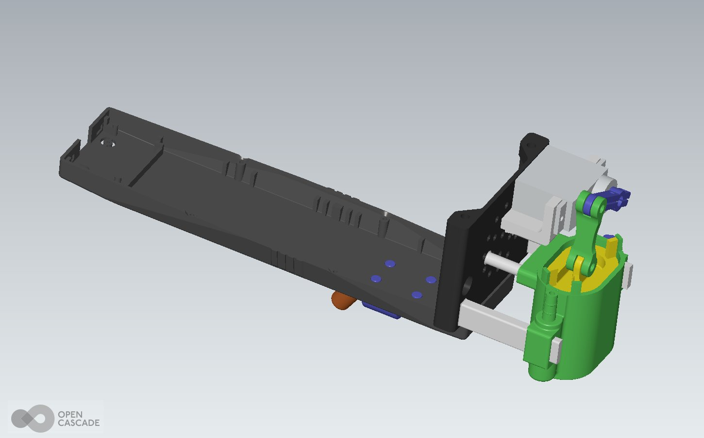
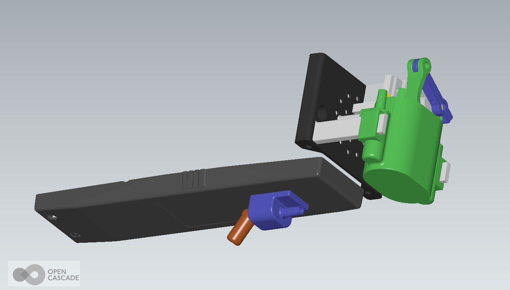
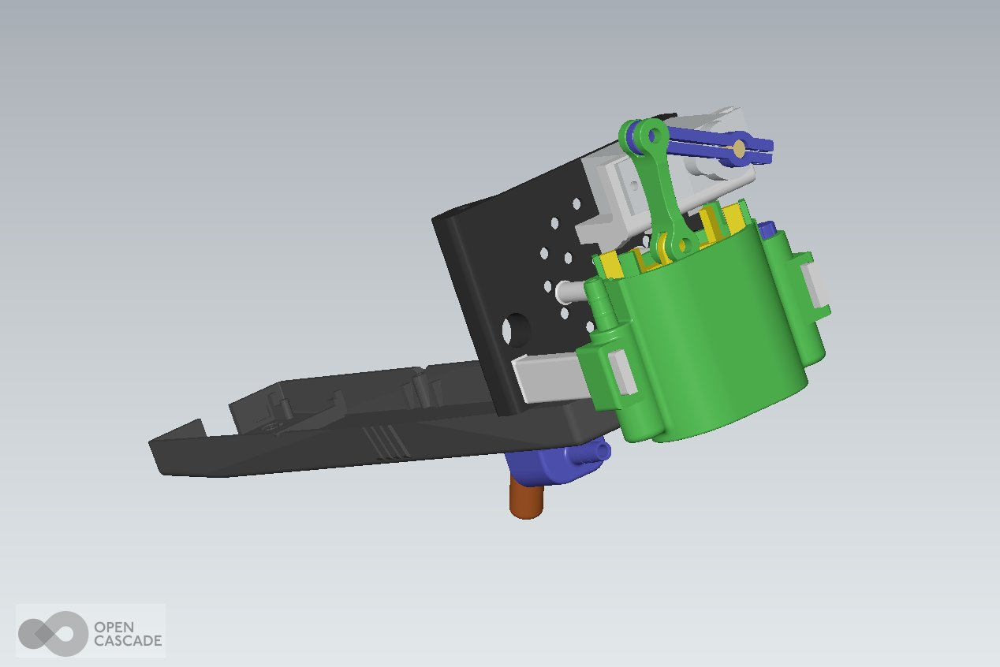
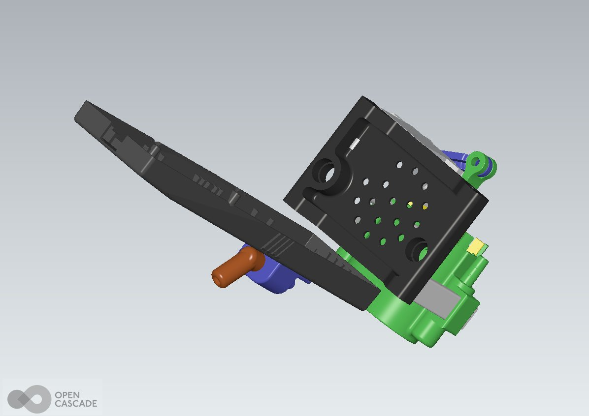
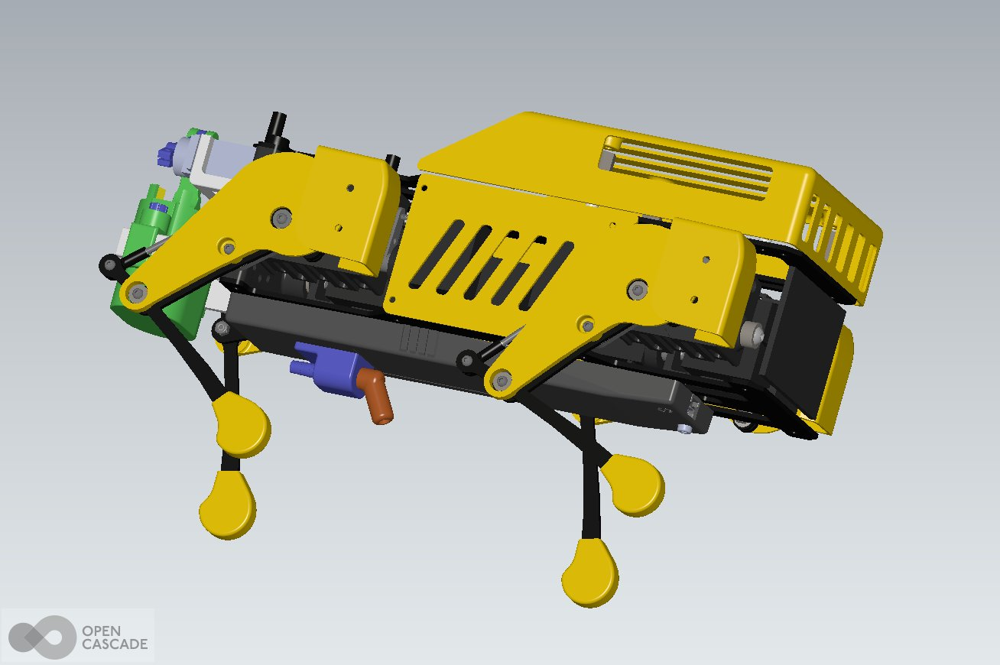
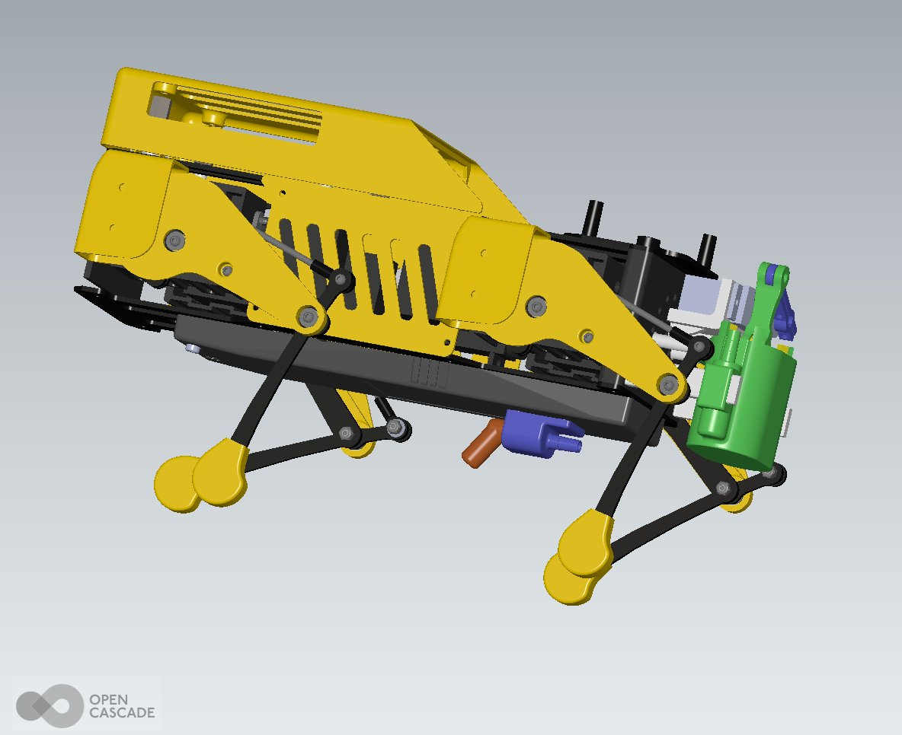
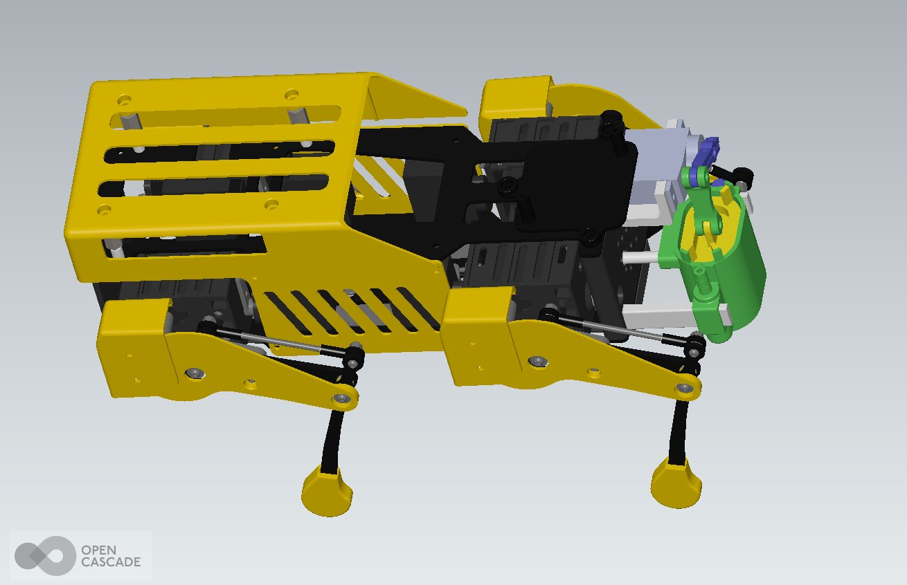
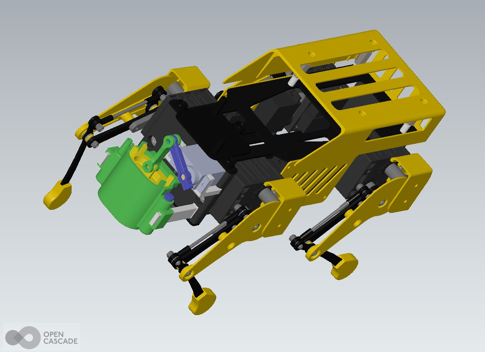
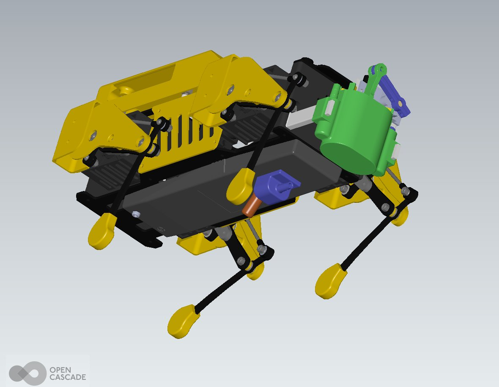
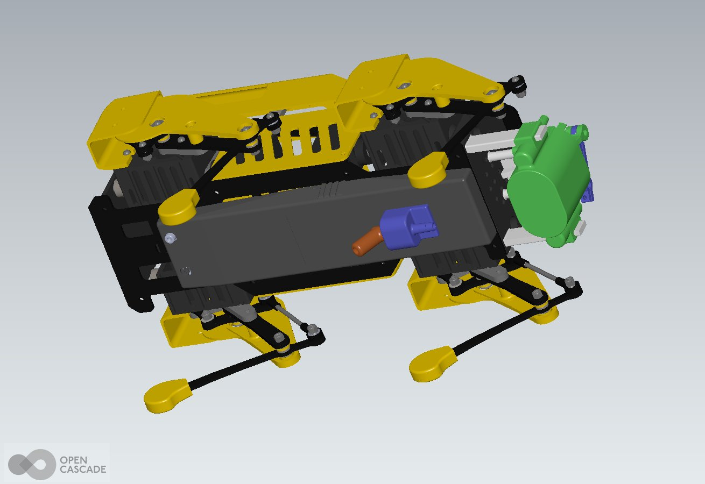

# FREISA 3D-Printable Parts

| Folder              | Description                           |
| ------------------- | ------------------------------------- |
| [`STL`](STL/)       | Mesh (files suitable for 3D-printing) |
| [`STP`](STP/)       | 3D Model (STEP)                       |
| [`images`](images/) | 3D rendering of parts and assemblies  |

## Pupper Head for FREISA v3.0 (2025)

[Eric](http://github.com/OrsoEric) wanted to make a dog-shaped LEGO&reg;-compatible RaspiCAM Holder for the Mini Pupper 2.

1. He used ComfyUI with Flux model to create a base image and Hunyuan3D model to convert the image to an STL with my [ComfyUI workflow](https://github.com/OrsoEric/HOWTO-ComfyUI#img-to-stl---3d-workflow-hunyuan) running locally on my 7900XTX

2. He used Creality Studio to cut and combine the dog head model with the OpenSCAD LEGO plate I developed for the previous hackaton and the Screwless Raspicam Holder I made in OpenSCAD

3. He sliced and printed the head with my Creality K1, first attempt was good

4. He installed the head on my red pupper and connected the raspicam. It does look like a muffler.

Links to 3D-printable parts:

- [Pupper Head STL](STL/Pupper_Head_Hunyuan3D.stl)
- [Pupper Head LEGO&reg; Plate STL](STL/LEGO-4x5.stl)

## FREISA v1.0 3D Parts (2023)

Developed and contributed by [Gianfranco Poncini](https://github.com/@Muwattalli).

Links to 3D-printable parts:

- [Biella.STL](STL/Biella.STL)
- [Body_Back_supporti.STL](STL/Body_Back_supporti.STL)
- [Body_Back_supporti_low.STL](STL/Body_Back_supporti_low.STL)
- [Holder.STL](STL/Holder.STL)
- [Leva.STL](STL/Leva.STL)
- [Pusher.STL](STL/Pusher.STL)
- [Rocco.STL](STL/Rocco.STL)
- [Shell_battery_up_Barolo.STL](STL/Shell_battery_up_Barolo.STL)
- [Tank.STL](STL/Tank.STL)
- [Tappo.STL](STL/Tappo.STL)

### Rendering of FREISA 3D-Parts Assembly

Rendering performed with [Salome-Meca 2023](https://code-aster-windows.com/category/posts/salome_meca-windows/)

### Rendering of FREISA 3D-Parts attached to Mini Pupper

Rendering performed with [Salome-Meca 2023](https://code-aster-windows.com/categor

## See also

- [OpenSCAD-lego-library](https://github.com/B-AROL-O/OpenSCAD-lego-library): OpenSCAD library to draw LEGO&reg; beams and LEGO plates with custom patterns

<!-- EOF -->
