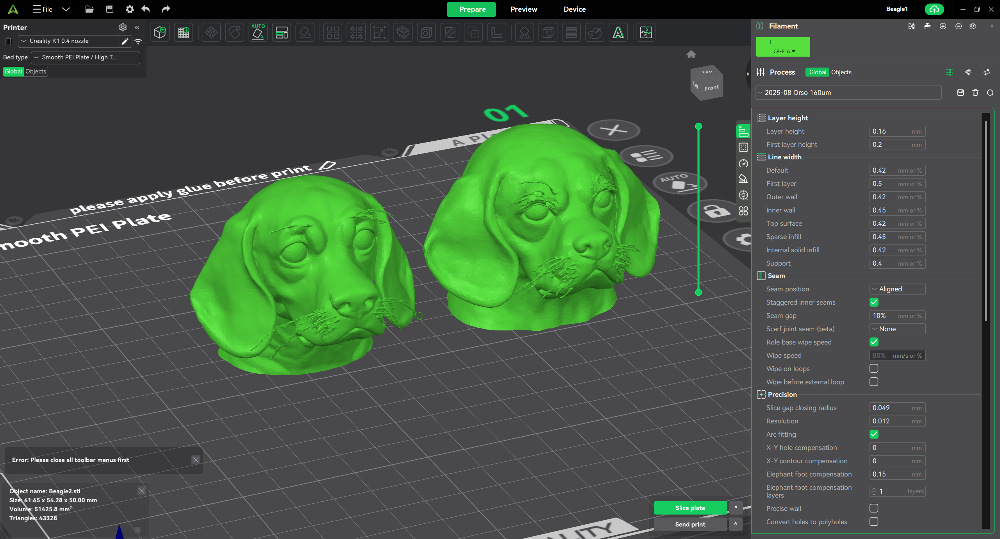

<<<<<<< HEAD
# Pupper Head

I wanted to make a dog shaped Raspicam Holder LEGO compatible for Pupper

1. I used ComfyUI with Flux model to create a base image and Hunyuan3D model to convert the image to an STL with my [ComfyUI workflow](https://github.com/OrsoEric/HOWTO-ComfyUI#img-to-stl---3d-workflow-hunyuan) running locally on my 7900XTX

2. I used Creality Studio to cut and combine the dog head model with the OpenSCAD LEGO plate I developed for the previous hackaton and the Screwless Raspicam Holder I made in OpenSCAD

3. I sliced and printed the head with my Creality K1, first attempt was good

4. I installed the head on my red pupper and connected the raspicam. It does look like a muffler.

[Pupper Head STL](/freisa-3dparts/STL/Pupper_Head_Hunyuan3D.stl)

[Pupper Head LEGO© Plate STL](/freisa-3dparts/STL/LEGO-4x5.stl)
=======
# 3D parts for FREISA Robot Dog

| Folder | Description
|--------|-------------
| [`STL`](STL/) | Mesh (files suitable for 3D-printing)
| [`STP`](STP/) | 3D Model (STEP)
| [`images`](images/) | Rendering by [Salome-Meca 2023](https://code-aster-windows.com/category/posts/salome_meca-windows/)

## Pupper Head

Eric wanted to make a dog shaped Raspicam Holder LEGO compatible for Pupper.

1. He used ComfyUI with Flux model to create a base image and Hunyuan3D model to convert the image to an STL with my [ComfyUI workflow](https://github.com/OrsoEric/HOWTO-ComfyUI#img-to-stl---3d-workflow-hunyuan) running locally on my 7900XTX

2. He used Creality Studio to cut and combine the dog head model with the OpenSCAD LEGO plate I developed for the previous hackaton and the Screwless Raspicam Holder I made in OpenSCAD

3. He sliced and printed the head with my Creality K1, first attempt was good

4. He installed the head on my red pupper and connected the raspicam. It does look like a muffler.

[Pupper Head STL](STL/Pupper_Head_Hunyuan3D.stl)

[Pupper Head LEGO© Plate STL](STL/LEGO-4x5.stl)

## See also

* [OpenSCAD-lego-library](https://github.com/B-AROL-O/OpenSCAD-lego-library): OpenSCAD library to draw LEGO&reg; beams and LEGO plates with custom patterns

<!-- EOF -->
>>>>>>> b24df72 (feat: merge the two READMEs into one single README.md)
